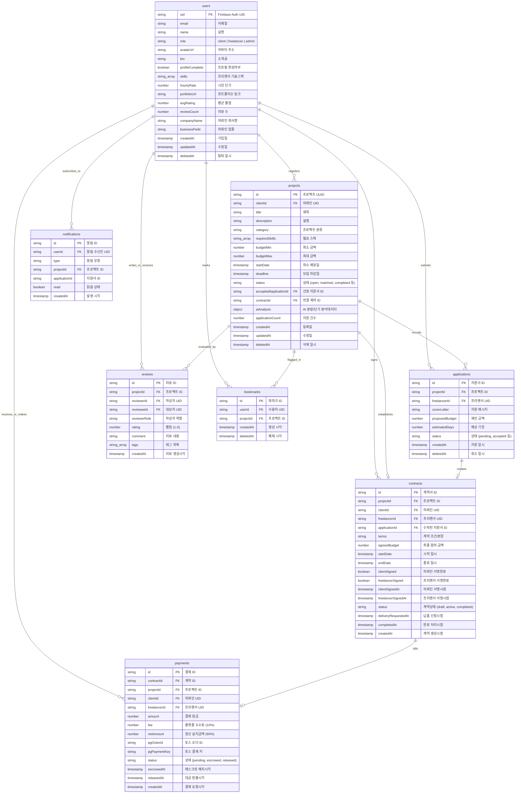

# PrestoLabs 데이터베이스 ERD 명세서

이 문서는 PrestoLabs 플랫폼의 핵심 비즈니스 로직을 구현하는 Firestore 데이터베이스 설계 사양을 정의합니다. 본 데이터베이스는 NoSQL 구조이지만 데이터 정합성과 트랜잭션 무결성을 지키기 위해 준 관계형(Semi-relational) 참조 관계를 따르고 있습니다.

---

## 🔗 원본 공유 및 편집 링크

* **Mermaid Live Editor (즉시 수정 및 시각화)**: [Mermaid Live Editor에서 편집하기](https://mermaid.live/edit#pako:eNq1V9tu2zAM_RVDz90P5K1rN2DYrUixtwABbTEuF11cik5ntP33QbVTx5HcNliXJ4c3i-dQJH2vKq9RLRTyJUHNYFeuKIqiDcihuO__xF8QJlcXLeni6msiRgtkEqkDi4mQvUmFsAMB_sVpjJL8KCu9NwiuaNhvyOCFt41BScKtgRm6ImzJmDAqXWtL5OLGt2y6JaR-ReNZNt6Qn5xk8INdvQQhVycaxh3h3YVvnSQhK28bcN2PHBRlG8hhCJ8JjR61QhaDgG2KihEE9bnklG2j55UaIzDPyseV6x8a9r-xkhy1eWYrQ-jkiy4-pzohyXCpMVRMjZB3aTQQrD13M4wx3rbEqK_zzJWtrlG-k5vTwJ8cFkGA5XLC9yFQoA25NI0gIG1IK7WqsInINo2hCmKWeXAq74ShOobOlxH_AujcgekCpVnCGPmopP5nYRy89e3FMVRTHoANIxpwFfIcQDvkbyiCnGDQsG98QP3xiddEjUHIxhwvoQuvMvdG2OaQ2RP5TrC8dKFegwxeKzpBtpmKqhlTLN94QdDpqWrfhPtErql2qFPtmMqxxQEdBxHynBxHOZcT2NZoaIfcLfG2xTDLezVMkTn1tGbGTgqdRXdKJ803hP9WM3vy7bSJDOINYiJzKOc2O8Wa-ifr-IaM5qoH4it2J3ATZ4S_m8Oc0SCEUxnpx_A7XdM-2NxFHLT4su9ysursl4WjHWLcEyKKM4NRoA6nQOG80Obkdh6Xvpm-0jV4Gn6TVpW2B0bQpyRUer-1wNv3SCZ_7n-cEv3C_PDw4YO_H7esRbFSjDUFQQ4rlTGdzN1oHtrSkuSNx1H0ZEm1y9s996b-_RXSDsPa89rCFvMu-8sTPe6YpLff-2ZdpkU2nD3ufiWGtfisz8hjtH96inZHy-kcNowVtwfgTB0ejvCJjJWGwg3OOEyzxh2YNhK_Lrs5--nxNwbqGvWa3JjD5MzZY_Xl9XykUTlYT8grnxZhpc6URbZAWi3U_UrJDVpcqcVKaeDtSj2qMwWt-OvOVWoh3OKZ6tfAT5rEs1pswIRn4fCpN0gf_wJs1X6C)
* **dbdiagram.io 스크립트 소스**: [ERD_dbml.txt](file:///Users/applw/Documents/Codex/PrestoLabs/docs/ERD_dbml.txt) 에서 DBML 스크립트 소스를 카피하여 [dbdiagram.io](https://dbdiagram.io) 에 붙여넣으면 대화형 다이어그램을 로드할 수 있습니다.

---

## 📊 데이터베이스 설계 다이어그램 (Mermaid)

---

## 📝 엔티티 상세 정보 명세

### 1. `users` (사용자 프로필)
* **설명**: 회원가입 시 생성되며, 사용자의 식별 정보 및 개인화 프로필 데이터를 보관합니다.
* **주요 비즈니스 제약**:
  - `role`은 `"client"`, `"freelancer"`, `"admin"`으로 제한됩니다.
  - 프리랜서의 경우 `skills` 배열이 최소 1개 이상 존재하고 `bio`가 입력되어야 `profileComplete`가 `true`로 설정됩니다.
  - 의뢰인의 경우 `bio`가 있어야 `profileComplete`가 `true`가 됩니다.
  - 소프트 딜리트 (`deletedAt`가 기입된 유저)는 목록 검색 등에서 제외됩니다.

### 2. `projects` (의뢰 프로젝트)
* **설명**: 의뢰인 유저가 요구사항과 예산을 등록하여 생성한 일감 데이터입니다.
* **주요 비즈니스 제약**:
  - 지원자(`applicationCount > 0`)가 1명이라도 있을 경우, 금액(`budgetMin`, `budgetMax`) 및 모집 마감일(`deadline`) 수정이 불가능합니다.
  - AI 분석 기능(`aiAnalysis`)은 비동기 호출을 통해 백그라운드 LLM 연산 후 업데이트됩니다.

### 3. `applications` (프로젝트 지원서)
* **설명**: 프리랜서가 프로젝트에 지원하며 제안서(소개서, 제안 단가, 소요 기한)를 기재한 문서입니다.
* **주요 비즈니스 제약**:
  - 한 프리랜서는 하나의 프로젝트에 한 번만 중복 없이 지원 가능합니다.
  - 프로젝트 상태가 `open` 또는 `in_review`인 경우에만 접수를 받습니다.

### 4. `contracts` (프로젝트 전자 계약서)
* **설명**: 의뢰인이 특정 프리랜서의 지원서를 수락할 때 자동 생성되는 전자적 합의 문서입니다.
* **주요 비즈니스 제약**:
  - 생성 초기에는 `draft` 상태이며, `clientSigned = true` 및 `freelancerSigned = true`가 모두 활성화되어야 상태가 `active`로 이행되거나 결제가 진행됩니다.

### 5. `payments` (에스크로 정산 결제 데이터)
* **설명**: 계약 체결 후 의뢰인이 토스페이먼츠 등을 통해 예치한 에스크로 거래 기록입니다.
* **주요 비즈니스 제약**:
  - 플랫폼 수수료율은 총 거래 대금의 10%(`fee`)로 설정되며, 이를 제하고 90%(`netAmount`)가 프리랜서 정산 대금으로 확정됩니다.
  - 의뢰인이 납품을 승인하면 `released` 상태로 변경되어 정산금이 방출됩니다.

### 6. `reviews` (평가 및 리뷰)
* **설명**: 프로젝트가 `completed` 상태가 되었을 때 상호 간에 매기는 별점과 후기입니다.
* **주요 비즈니스 제약**:
  - 평점(`rating`)은 1~5점 사이의 정수여야 합니다.
  - 리뷰 작성 성공 시 대상 유저의 `avgRating`과 `reviewCount`가 Firestore Transaction을 통해 즉시 가중 연산되어 변경됩니다.

### 7. `notifications` (알림)
* **설명**: 매칭 성공, 지원서 도달, 계약 완료 등 중요 시점마다 발송되는 푸시 및 알림 내역입니다.

### 8. `bookmarks` (관심 프로젝트 북마크)
* **설명**: 유저가 프로젝트를 찜해두는 매핑 테이블 형태의 정보입니다. 토글 시 물리 삭제가 아닌 `deletedAt: null` 과 `deletedAt: Timestamp.now()` 간의 토글을 사용해 소프트 딜리트 처리합니다.
